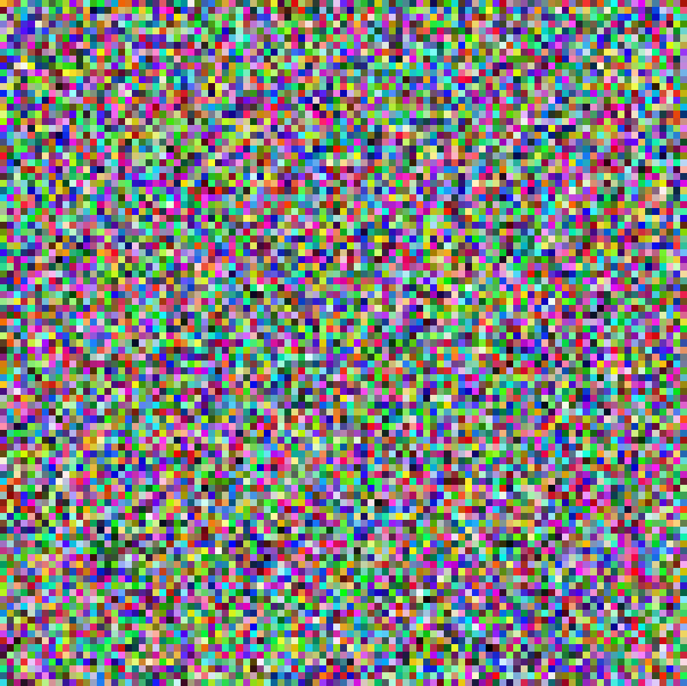
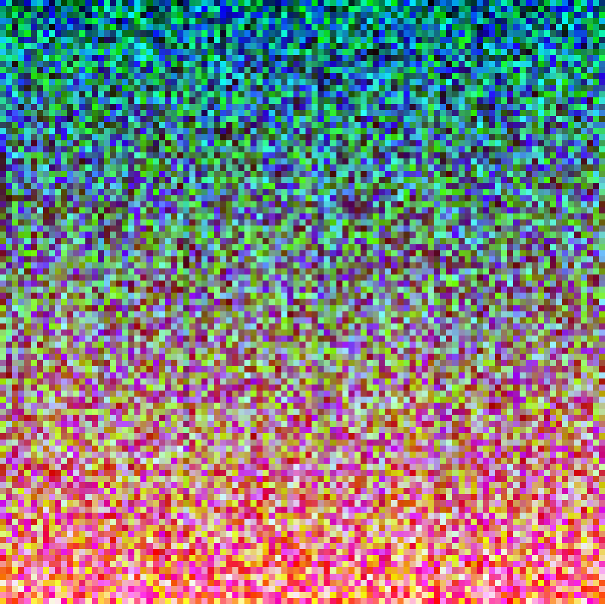
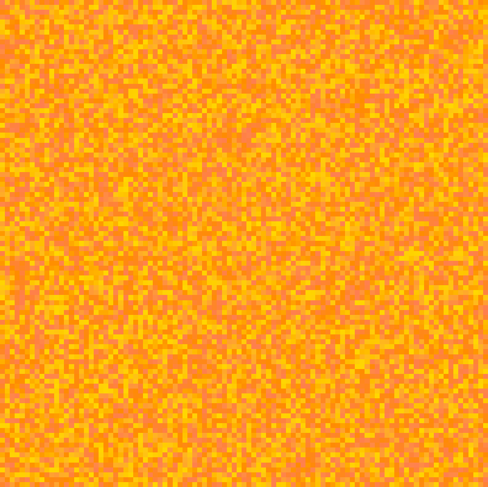

This was a GitHub Noop Challenge, in this challenge they give you access to an API, which generates a random hex value, or a random hex value from a seed.

The original repo is here: https://github.com/noops-challenge/hexbot

The challenge is here: https://noopschallenge.com/challenges/hexbot

This is my first time working with images, and API so excuse the crappie code please :))

# Dependencies

Python 3

Linux install:

```bash
pip3 install pillow
pip3 install certify
pip3 install urllib3
pip3 install urllib3[secure]
```

Windows install:

```cmd
pip install pillow
pip install certify
pip install urllib3
pip install urllib3[secure]
```

# 🖍 What can you do?

Still in development, but so far two functions have been created:

## Generate colour blocks

This simply generates a 100*100 image and saves it into the blocks directory, just run the python file and enter 1, and they will be generated

## Create gradient / sort pixels generated

This funtion requests 10,000 hex values, saves them unsorted as image, then sorts the pixels in value. I will be adding option to add seed as this works the best with it.

### No seed

#### Unsorted


#### Sorted


### Seed of FF7F50, FFD700, FF8C00

#### Unsorted


#### Sorted

